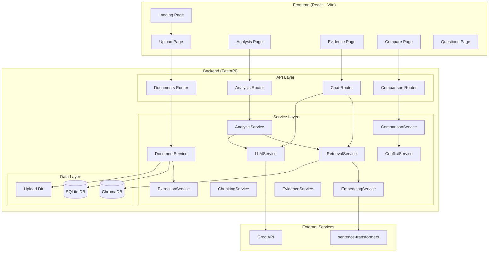
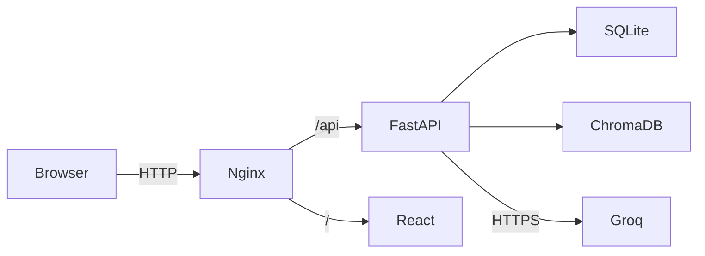

# 05 — System Architecture

## Overview

ClausePilot is a full-stack monorepo with a React frontend and a FastAPI backend. The AI pipeline uses Groq for LLM inference, sentence-transformers for embeddings, and ChromaDB for vector retrieval.

## Architecture Diagram

## Component Responsibilities

| Component | Responsibility |
|---|---|
| `DocumentService` | Upload orchestration, persistence |
| `ExtractionService` | PyMuPDF — PDF text + page extraction |
| `ChunkingService` | Overlapping text chunk creation |
| `EmbeddingService` | sentence-transformers dense vectors |
| `RetrievalService` | ChromaDB semantic search |
| `LLMService` | Groq API structured JSON output |
| `EvidenceService` | Citation validation against stored pages |
| `AnalysisService` | Attention map, obligations, risks |
| `ComparisonService` | Semantic document alignment + diff |
| `ConflictService` | Clause conflict classification |

## Deployment Architecture

