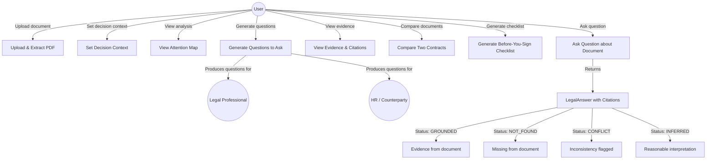

# 06 — Use Case Diagram

## Primary Use Cases

## Use Case Descriptions

### UC1: Upload & Extract PDF
**Actor**: User  
**Precondition**: User has a PDF document  
**Flow**:
1. User uploads PDF
2. System validates file type and size
3. System generates UUID-based server filename
4. System extracts text page by page using PyMuPDF
5. System stores metadata and page text in SQLite
6. System returns document ID and page count

### UC2: Set Decision Context
**Actor**: User  
**Flow**: User selects or types their decision context (e.g., "I'm deciding whether to accept this job offer"). System uses this to prioritize analysis.

### UC3: View Attention Map
**Actor**: User  
**Flow**: After analysis, user sees color-coded attention items (HIGH/MEDIUM/LOW/MISSING/CONFLICT) by category. Clicking an item shows source evidence.

### UC4: Ask Question
**Actor**: User  
**Flow**:
1. User types a question
2. System embeds question and retrieves relevant chunks
3. LLM generates structured answer with status and citations
4. User sees answer + evidence + suggested follow-up questions

### UC5: View Evidence & Citations
**Actor**: User  
**Flow**: User clicks on a citation to see the exact quote, page number, and clause number from the original document.

### UC6: Compare Two Contracts
**Actor**: User  
**Flow**:
1. User uploads two documents
2. System aligns clauses semantically
3. System identifies additions, removals, changes
4. LLM explains differences with evidence from both documents

### UC7: Generate Checklist
**Actor**: User  
**Flow**: System generates a prioritized "Before You Sign" checklist based on identified attention items and missing information.

### UC8: Generate Questions
**Actor**: User  
**Flow**: System generates targeted questions for HR/counterparty and for a legal professional, grounded in identified uncertainties.
