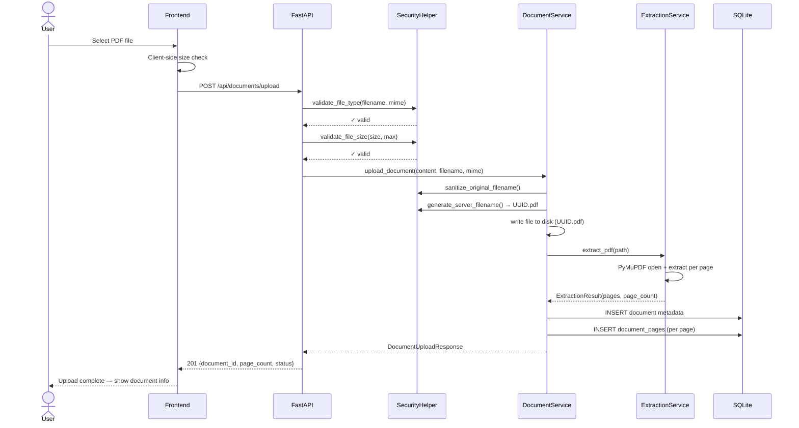
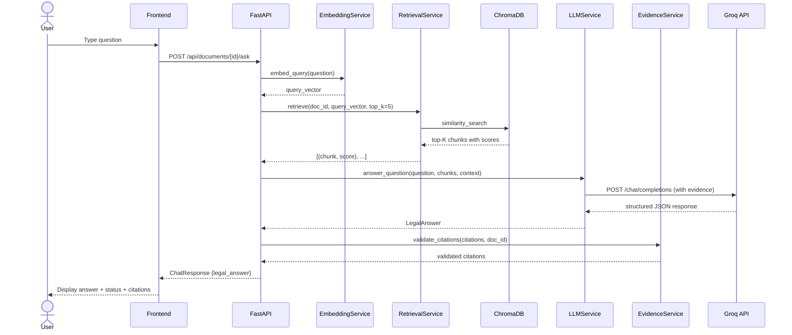
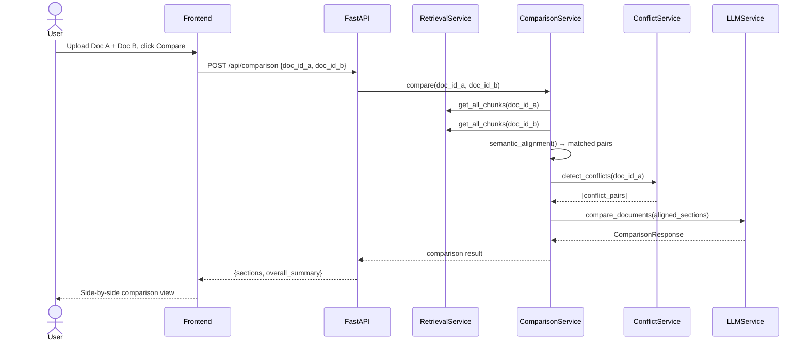

# 07 — Sequence Diagrams

## SD-01: Document Upload Flow

```mermaid
sequenceDiagram
    actor User
    participant FE as Frontend
    participant API as FastAPI
    participant SEC as SecurityHelper
    participant DS as DocumentService
    participant EX as ExtractionService
    participant DB as SQLite

    User->>FE: Select PDF file
    FE->>FE: Client-side size check
    FE->>API: POST /api/documents/upload
    API->>SEC: validate_file_type(filename, mime)
    SEC-->>API: ✓ valid
    API->>SEC: validate_file_size(size, max)
    SEC-->>API: ✓ valid
    API->>DS: upload_document(content, filename, mime)
    DS->>SEC: sanitize_original_filename()
    DS->>SEC: generate_server_filename() → UUID.pdf
    DS->>DS: write file to disk (UUID.pdf)
    DS->>EX: extract_pdf(path)
    EX->>EX: PyMuPDF open + extract per page
    EX-->>DS: ExtractionResult(pages, page_count)
    DS->>DB: INSERT document metadata
    DS->>DB: INSERT document_pages (per page)
    DS-->>API: DocumentUploadResponse
    API-->>FE: 201 {document_id, page_count, status}
    FE-->>User: Upload complete — show document info
```

## SD-02: Ask a Question (Phase 2)

```mermaid
sequenceDiagram
    actor User
    participant FE as Frontend
    participant API as FastAPI
    participant EM as EmbeddingService
    participant RT as RetrievalService
    participant DB as ChromaDB
    participant LLM as LLMService
    participant EV as EvidenceService
    participant GQ as Groq API

    User->>FE: Type question
    FE->>API: POST /api/documents/{id}/ask
    API->>EM: embed_query(question)
    EM-->>API: query_vector
    API->>RT: retrieve(doc_id, query_vector, top_k=5)
    RT->>DB: similarity_search
    DB-->>RT: top-K chunks with scores
    RT-->>API: [(chunk, score), ...]
    API->>LLM: answer_question(question, chunks, context)
    LLM->>GQ: POST /chat/completions (with evidence)
    GQ-->>LLM: structured JSON response
    LLM-->>API: LegalAnswer
    API->>EV: validate_citations(citations, doc_id)
    EV-->>API: validated citations
    API-->>FE: ChatResponse {legal_answer}
    FE-->>User: Display answer + status + citations
```

## SD-03: Document Comparison (Phase 4)

```mermaid
sequenceDiagram
    actor User
    participant FE as Frontend
    participant API as FastAPI
    participant RT as RetrievalService
    participant CO as ComparisonService
    participant CF as ConflictService
    participant LLM as LLMService

    User->>FE: Upload Doc A + Doc B, click Compare
    FE->>API: POST /api/comparison {doc_id_a, doc_id_b}
    API->>CO: compare(doc_id_a, doc_id_b)
    CO->>RT: get_all_chunks(doc_id_a)
    CO->>RT: get_all_chunks(doc_id_b)
    CO->>CO: semantic_alignment() → matched pairs
    CO->>CF: detect_conflicts(doc_id_a)
    CF-->>CO: [conflict_pairs]
    CO->>LLM: compare_documents(aligned_sections)
    LLM-->>CO: ComparisonResponse
    CO-->>API: comparison result
    API-->>FE: {sections, overall_summary}
    FE-->>User: Side-by-side comparison view
```
