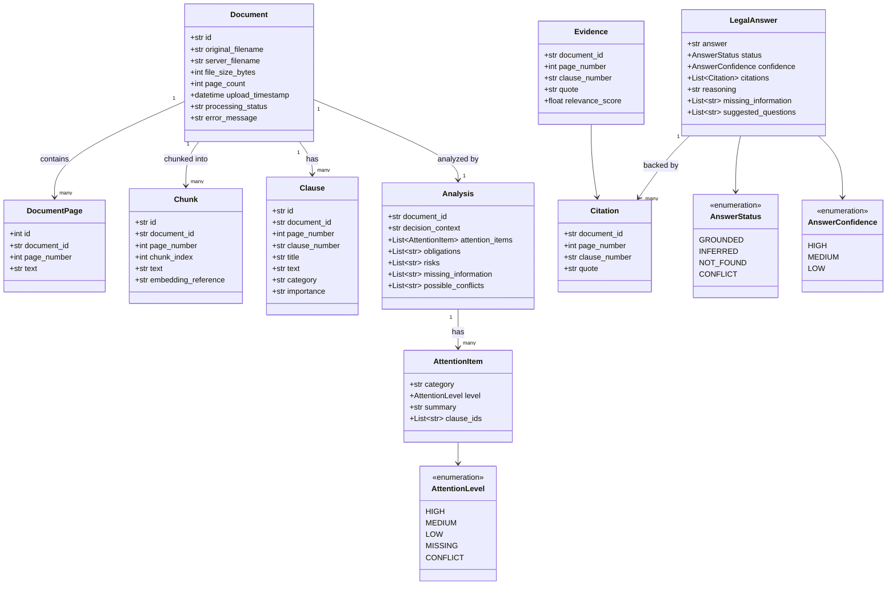
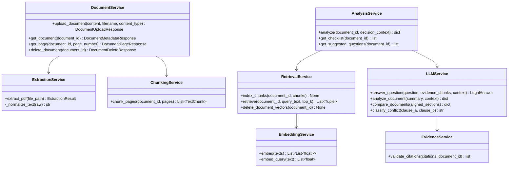

# 08 — Class Diagram

## Core Domain Model

```mermaid
classDiagram
    class Document {
        +str id
        +str original_filename
        +str server_filename
        +int file_size_bytes
        +int page_count
        +datetime upload_timestamp
        +str processing_status
        +str error_message
    }

    class DocumentPage {
        +int id
        +str document_id
        +int page_number
        +str text
    }

    class Chunk {
        +str id
        +str document_id
        +int page_number
        +int chunk_index
        +str text
        +str embedding_reference
    }

    class Clause {
        +str id
        +str document_id
        +int page_number
        +str clause_number
        +str title
        +str text
        +str category
        +str importance
    }

    class LegalAnswer {
        +str answer
        +AnswerStatus status
        +AnswerConfidence confidence
        +List~Citation~ citations
        +str reasoning
        +List~str~ missing_information
        +List~str~ suggested_questions
    }

    class Citation {
        +str document_id
        +int page_number
        +str clause_number
        +str quote
    }

    class Evidence {
        +str document_id
        +int page_number
        +str clause_number
        +str quote
        +float relevance_score
    }

    class Analysis {
        +str document_id
        +str decision_context
        +List~AttentionItem~ attention_items
        +List~str~ obligations
        +List~str~ risks
        +List~str~ missing_information
        +List~str~ possible_conflicts
    }

    class AttentionItem {
        +str category
        +AttentionLevel level
        +str summary
        +List~str~ clause_ids
    }

    class AnswerStatus {
        <<enumeration>>
        GROUNDED
        INFERRED
        NOT_FOUND
        CONFLICT
    }

    class AnswerConfidence {
        <<enumeration>>
        HIGH
        MEDIUM
        LOW
    }

    class AttentionLevel {
        <<enumeration>>
        HIGH
        MEDIUM
        LOW
        MISSING
        CONFLICT
    }

    Document "1" --> "many" DocumentPage : contains
    Document "1" --> "many" Chunk : chunked into
    Document "1" --> "many" Clause : has
    Document "1" --> "1" Analysis : analyzed by
    Analysis "1" --> "many" AttentionItem : has
    LegalAnswer "1" --> "many" Citation : backed by
    LegalAnswer --> AnswerStatus
    LegalAnswer --> AnswerConfidence
    AttentionItem --> AttentionLevel
    Evidence --> Citation
```

## Service Layer

```mermaid
classDiagram
    class DocumentService {
        +upload_document(content, filename, content_type) DocumentUploadResponse
        +get_document(document_id) DocumentMetadataResponse
        +get_page(document_id, page_number) DocumentPageResponse
        +delete_document(document_id) DocumentDeleteResponse
    }

    class ExtractionService {
        +extract_pdf(file_path) ExtractionResult
        -_normalize_text(raw) str
    }

    class ChunkingService {
        +chunk_pages(document_id, pages) List~TextChunk~
    }

    class EmbeddingService {
        +embed(texts) List~List~float~~
        +embed_query(text) List~float~
    }

    class RetrievalService {
        +index_chunks(document_id, chunks) None
        +retrieve(document_id, query_text, top_k) List~Tuple~
        +delete_document_vectors(document_id) None
    }

    class LLMService {
        +answer_question(question, evidence_chunks, context) LegalAnswer
        +analyze_document(summary, context) dict
        +compare_documents(aligned_sections) dict
        +classify_conflict(clause_a, clause_b) str
    }

    class EvidenceService {
        +validate_citations(citations, document_id) list
    }

    class AnalysisService {
        +analyze(document_id, decision_context) dict
        +get_checklist(document_id) list
        +get_suggested_questions(document_id) list
    }

    DocumentService --> ExtractionService
    DocumentService --> ChunkingService
    RetrievalService --> EmbeddingService
    LLMService --> EvidenceService
    AnalysisService --> RetrievalService
    AnalysisService --> LLMService
```
