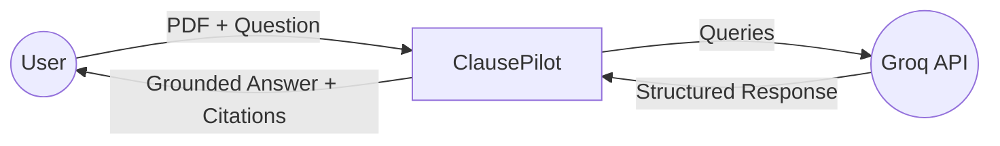
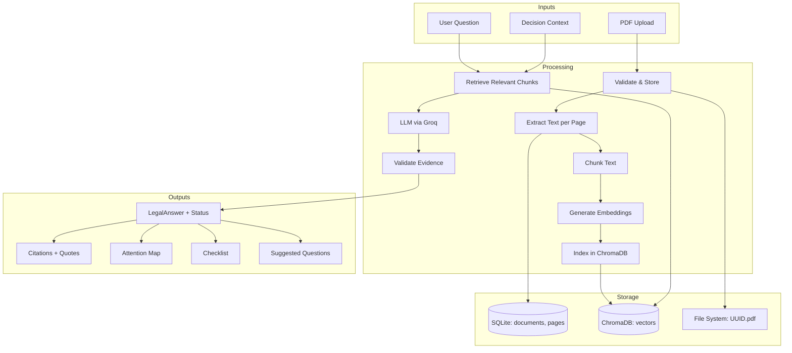

# 09 — Data Flow Diagram

## Level 0 — Context Diagram

## Level 1 — Main Data Flows

## Data States

| State | Description |
|---|---|
| `uploaded` | File received, not yet extracted |
| `extracted` | Text extracted successfully |
| `extracted_no_text` | Scanned PDF — no text layer |
| `indexed` | Chunks embedded and indexed in vector store |
| `error` | Processing failed (message stored) |

## Evidence Grounding States

| Status | Meaning |
|---|---|
| `GROUNDED` | Document directly supports the answer |
| `INFERRED` | Reasonable interpretation from document |
| `NOT_FOUND` | Information absent from document |
| `CONFLICT` | Two sections appear inconsistent |
